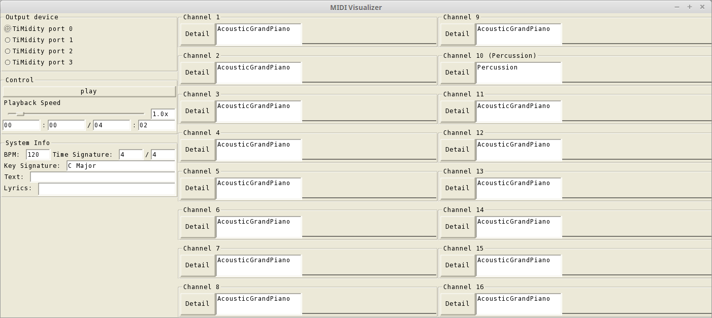
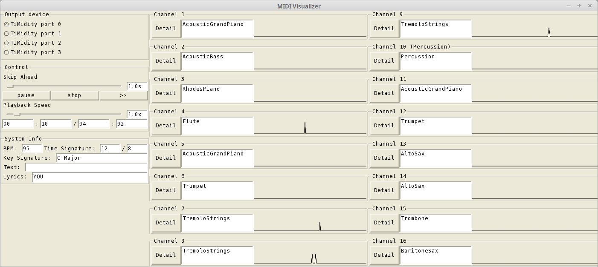
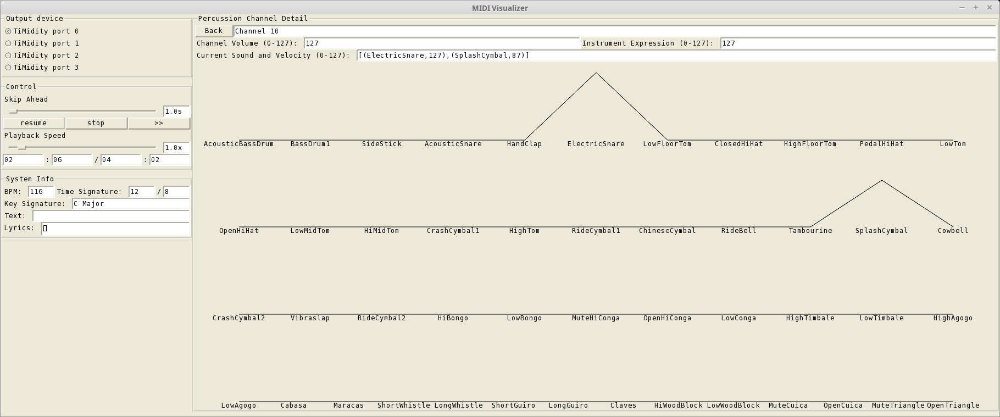

MIDI Visualizer
================
a haskell program for visualizing midi files, final project of Yale University CPSC 431 (Introduction to Computer Music I: Algorithmic and Heuristic Composition)

## Dependencies

- [Euterpea v1.0.0](https://github.com/Euterpea/Euterpea)

## Usage

```
% visualize PATH_TO_MID_FILE
```


## Introduction

visualize is a MIDI player with lots of helpful visualizations to show what is going on when you hear MIDI music in real time. It sends all MIDI messages to the port specified but also displays helpful information based on those messages. Specifically, it handles the following types of MIDI messages

- NoteOn/NoteOff
- ProgramChange
- TempoChange
- TimeSignature
- KeySignature
- Text
- Lyrics
- ControlChange 7,11, and 123

For each MIDI channel, it displays a graph of the current volume for each key and the instrument used. For the Percussion Channel it displays the percussion sound too.

As a player, it allows basic controls such as play/pause/resume/stop as well as advanced controls such as playback speed and skipping ahead.

## Screenshots







